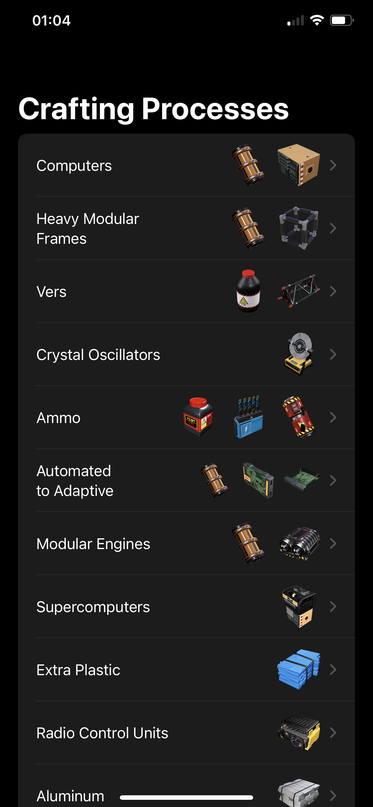
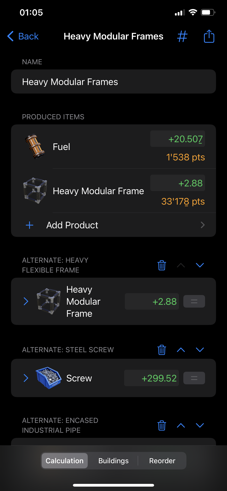
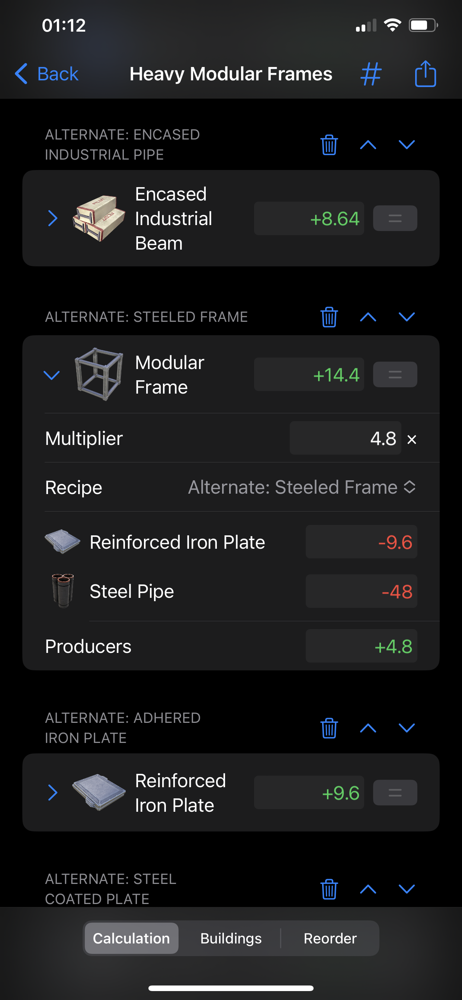
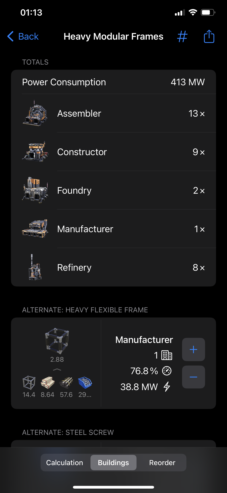
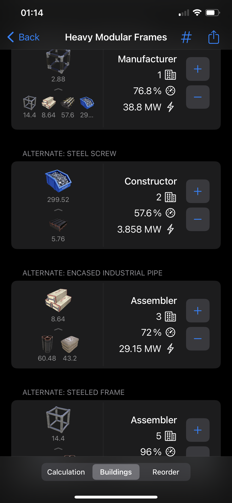
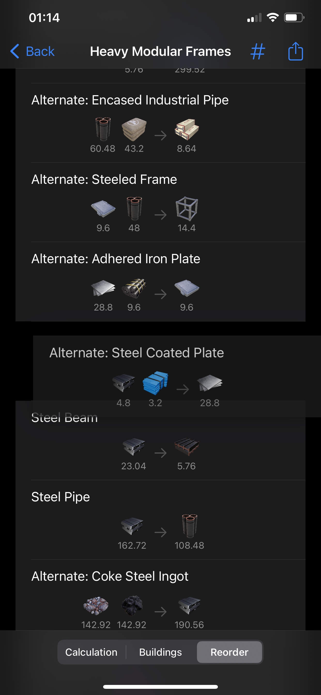

  

# Satisplannery

This is a production planning app for the game Satisfactory. It's a lot less "magical" than other production planners, leaving you to put together all the steps and configure them as you see fit, while taking care of the annoying parts like making a step produce as much of its output as you need for all subsequent steps. It also uses fractions to avoid floating-point precision errors, and lets you enter numbers as fractions too, though it can display as decimals too.

## Screenshots

  

  
  

  
  

  

